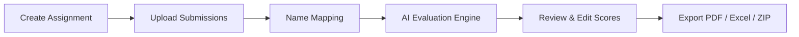

# GradeWise 🎓

[](https://opensource.org/licenses/MIT)
[](https://fastapi.tiangolo.com)
[](https://react.dev)
[](https://www.typescriptlang.org)
[](https://vitejs.dev)
[](https://tailwindcss.com)
[](https://aistudio.google.com)

**GradeWise** is an intelligent, high-efficiency evaluation platform built specifically for English educators and instructors. It streamlines the grading of essays, narrative writing, descriptive paragraphs, and letters through standardized rubrics, checklist validation, and context-aware feedback powered by Google Gemini AI.

---

## ✨ Features

### 1. 📂 Bulk Assignment Evaluation (Module 1)
- **Multi-Format Ingestion:** Accepts bulk uploads as ZIP archives or individual `.pdf`, `.docx`, and `.txt` files.
- **Intelligent Name Detection:** Automatically extracts student names from headers, titles, and filenames with confidence scoring and manual mapping resolution.
- **Batch AI Grading:** Concurrent asynchronous evaluation pipeline with live progress tracking (supports pause, resume, and retry).
- **Comprehensive Rubric & Checklist Checks:** Automatically validates word counts, paragraph structure, and qualitative rubric criteria (Content, Organization, Grammar, Vocabulary).

### 2. 📝 Split-Screen Review & Editing
- Side-by-side layout: original student essay on the left; detailed rubric breakdown, checklist indicators, and feedback on the right.
- Editable scores, auto-recalculating totals and percentages.
- Feedback editor with one-click **Copy Feedback**, **Copy Score**, and **Copy Full Summary** (with automatic cross-browser clipboard fallback).
- Single-click PDF and Word report downloads directly from the review page.

### 3. ⚡ Manual Paste Quick Grader (Module 2)
- Fast, synchronous evaluation designed for single essays and fast turnaround.
- Live word counter and configurable assignment presets (Essay, Narrative, Descriptive, Letter, Report, Creative).
- Instant feedback ready to paste directly into school grading portals (Canvas, Google Classroom, Blackboard).

### 4. 📊 Multi-Format Export Engine
- **Branded PDF Reports:** Formatted individual evaluation reports featuring student info, criterion scores, progress indicators, and actionable feedback.
- **Word (.docx) Reports:** Editable DOCX versions for classroom printing or digital distribution.
- **Excel & CSV Summaries:** Complete gradebook spreadsheets with per-criterion scores, percentages, letter grades, and feedback comments.
- **Bulk ZIP Bundles:** Single-click archive containing all individual PDF reports for an entire class.

### 5. 🔒 Security & Privacy First
- Zero plaintext API key storage — masked display in the UI and stored securely in local environment configuration.
- Local SQLite database out of the box with zero external configuration needed.

---

## 🛠️ Tech Stack

| Layer | Technologies |
| :--- | :--- |
| **Frontend** | React 18, TypeScript, Vite, Tailwind CSS, Lucide Icons, TanStack Query (React Query), Axios |
| **Backend** | Python 3.11+, FastAPI, SQLAlchemy 2.0 (Asyncio), SQLite / PostgreSQL support, Alembic, Structlog |
| **AI Engine** | Google Gemini API (`gemini-1.5-pro` / `gemini-1.5-flash`) via `google-generativeai` |
| **Document Processing** | PyMuPDF (fitz), python-docx, ReportLab, openpyxl |

---

## 🚀 Quick Start Guide

### Prerequisites
- **Python 3.11+** installed
- **Node.js 20+** and `npm` installed
- A **Google Gemini API Key** (Get one free from [Google AI Studio](https://aistudio.google.com/app/apikey))

---

### Step 1: Clone the Repository
```bash
git clone https://github.com/muhammadumerrafiq/GradeWise.git
cd GradeWise
```

---

### Step 2: Configure and Start the Backend

1. Navigate to the backend directory:
   ```bash
   cd backend
   ```

2. Create your `.env` configuration file from the example template:
   ```bash
   # Windows PowerShell / CMD
   copy .env.example .env

   # macOS / Linux
   cp .env.example .env
   ```

3. Open `.env` in an editor and enter your Gemini API key:
   ```env
   GEMINI_API_KEY=your_actual_gemini_api_key
   ```
   *(Default SQLite database path works automatically out of the box).*

4. Set up a Python virtual environment and install dependencies:
   ```bash
   python -m venv .venv

   # Activate virtual environment:
   # Windows:
   .venv\Scripts\activate
   # macOS / Linux:
   source .venv/bin/activate

   # Install dependencies:
   pip install -r requirements.txt
   ```

5. Launch the FastAPI backend server:
   ```bash
   uvicorn main:app --reload --port 8000
   ```
   *The backend will initialize the SQLite database tables automatically at `http://localhost:8000`.*

---

### Step 3: Configure and Start the Frontend

1. Open a new terminal and navigate to the frontend directory:
   ```bash
   cd frontend
   ```

2. Install dependencies:
   ```bash
   npm install
   ```

3. Start the Vite development server:
   ```bash
   npm run dev
   ```

4. Open your browser and navigate to:
   **[http://localhost:5173](http://localhost:5173)**

---

## 🧭 Typical Workflow



1. **Create Assignment:** Go to **New Assignment**, select the genre (Essay, Narrative, etc.), configure rubric criteria and requirements (e.g. length 400-600 words).
2. **Upload Student Submissions:** Upload a ZIP archive or individual student files.
3. **Verify Names:** Use the Name Mapping table to review detected student names and assign unlinked files.
4. **Evaluate:** Trigger batch evaluation and monitor real-time progress.
5. **Review & Refine:** Inspect individual student evaluations, modify marks or comments if needed, and click **Approve**.
6. **Export & Distribute:** Download individual PDFs or generate a full Excel summary spreadsheet and ZIP package for the entire class.

---

## 🔌 API Endpoints Overview

| Method | Endpoint | Description |
| :--- | :--- | :--- |
| `GET` | `/api/health` | Service health status and Gemini configuration check |
| `GET` | `/api/assignments` | List all assignments with submission statistics |
| `POST` | `/api/assignments` | Create a new assignment with rubric and requirements |
| `POST` | `/api/assignments/{id}/upload` | Upload student essay submissions (single or batch) |
| `POST` | `/api/assignments/{id}/evaluate` | Trigger batch AI evaluation |
| `GET` | `/api/assignments/{id}/results` | Retrieve graded results and performance metrics |
| `GET` | `/api/evaluations/{id}` | Detailed split-view evaluation payload |
| `PUT` | `/api/evaluations/{id}` | Update score breakdown, override grades, or modify feedback |
| `GET` | `/api/export/single/{sub_id}/pdf` | Direct download of individual student PDF evaluation |
| `POST` | `/api/assignments/{id}/export` | Generate class-wide Excel/CSV summaries or Bulk ZIP |
| `GET` | `/api/manual/sessions` | List manual paste grading sessions |
| `POST` | `/api/manual/evaluate` | Instant synchronous essay evaluation |
| `GET` | `/api/settings` | Retrieve teacher preferences and masked API key status |
| `PUT` | `/api/settings` | Update settings and API key |

---

## 📁 Repository Structure

```
GradeWise/
├── backend/
│   ├── main.py                     # FastAPI entry point & route definitions
│   ├── config.py                   # Pydantic settings & environment configuration
│   ├── database.py                 # Async SQLAlchemy engine & GUID type handler
│   ├── models/                     # SQLAlchemy ORM models (Assignment, Evaluation, etc.)
│   ├── routers/                    # API route handlers (assignments, evaluations, export, manual)
│   ├── schemas/                    # Pydantic validation schemas
│   ├── services/                   # Business logic (Gemini AI, extractors, exports)
│   ├── requirements.txt            # Python dependencies
│   └── .env.example                # Backend environment template
├── frontend/
│   ├── src/
│   │   ├── pages/                  # React views (Dashboard, Results, StudentDetail, etc.)
│   │   ├── components/             # Reusable UI primitives and layout
│   │   ├── api/                    # Axios API client & endpoints
│   │   ├── utils/                  # Cross-browser clipboard helper & utilities
│   │   └── types/                  # TypeScript interface definitions
│   ├── package.json                # Frontend dependencies & scripts
│   ├── vite.config.ts              # Vite configuration & backend proxy
│   └── .env.example                # Frontend environment template
├── sample_submissions/             # Sample essays (.txt, .docx, .pdf) for quick testing
├── docker-compose.yml              # Optional Docker service orchestration
├── .gitignore                      # Comprehensive git ignore rules
├── LICENSE                         # MIT License
└── README.md                       # Project documentation
```

---

## 📄 License

This project is licensed under the [MIT License](LICENSE) © 2026 Muhammad Umer Rafiq.
